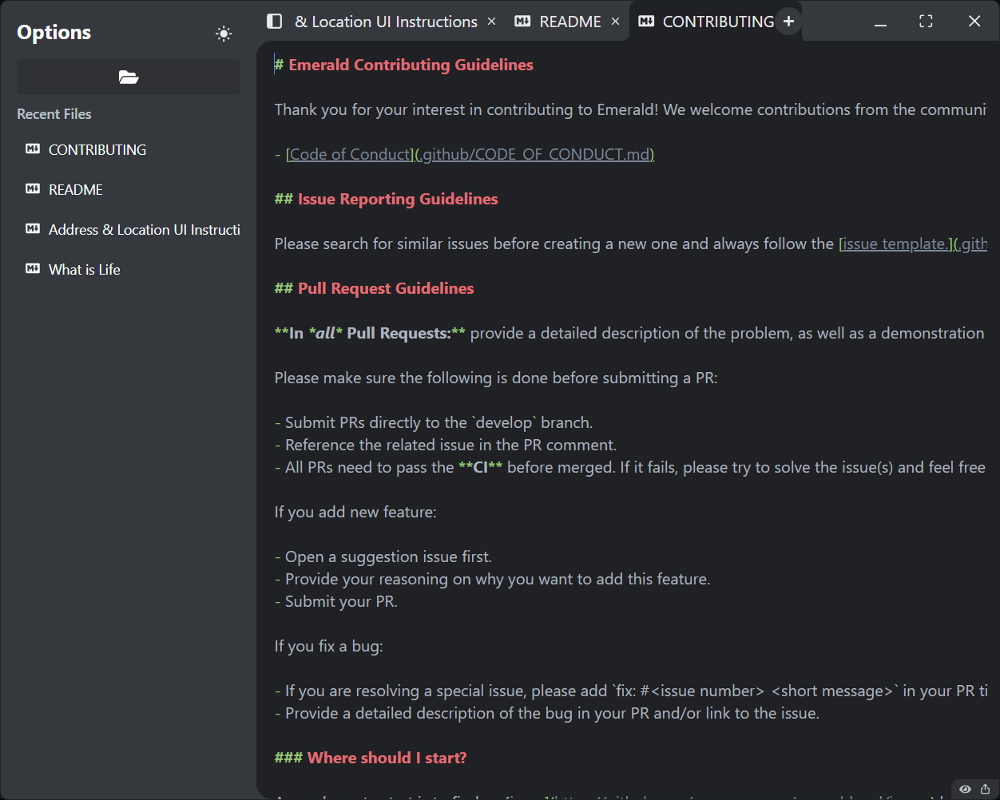
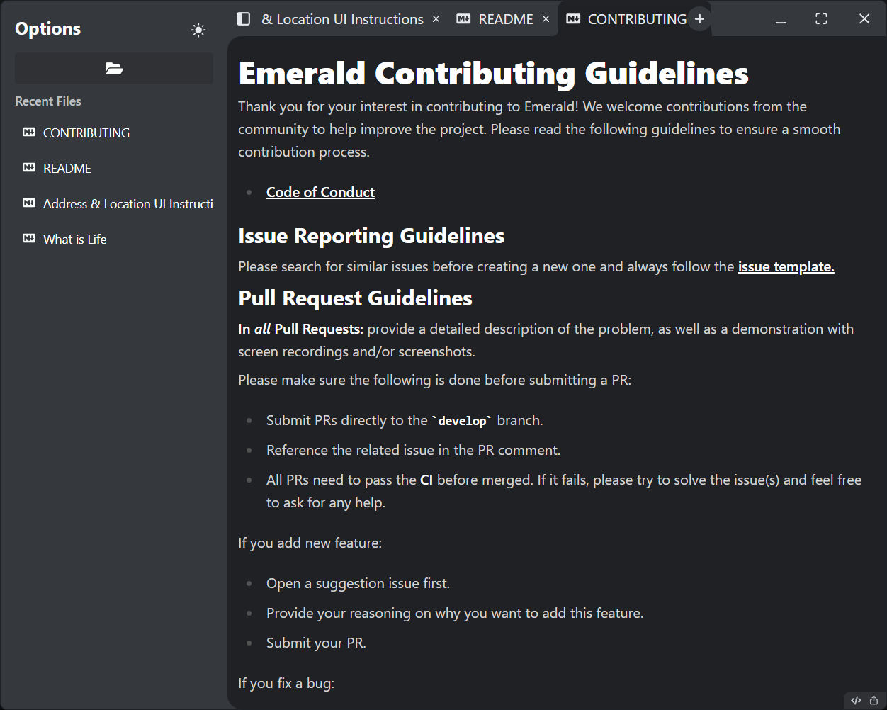

<h1 align="center" style="margin-top:0px">Emerald</h1>

<b>Polished Markdown editor for focused writing. </b>
 
Available for Linux, macOS and Windows.

  Built with ❤︎ by
  <a href="https://github.com/armanmaurya">Arman Maurya</a>
  .
  

## Screenshots

  <table style="border: none; border-collapse: collapse; padding: 0; margin: 0;">
    <tr>
      <td style="border: none; padding: 0 10px 0 0;"></td>
      <td style="border: none; padding: 0 0 0 10px;"></td>
    </tr>
    <tr>
      <td align="center" style="border: none; padding: 10px 10px 0 0;"><b>Source Mode</b></td>
      <td align="center" style="border: none; padding: 10px 0 0 10px;"><b>Preview Mode</b></td>
    </tr>
  </table>

## Features
- Realtime preview (WYSIWYG) and a polished interface with split view.
- Supprot all major markdown syntax.
- Full Keyboard Controls.
- Editing modes: **Source**, **Preview**.

## Why Emerald?
- Loves Writing. Used lot of markdown editors but none felt right. some are multi tabs but not capable of open file from disk, some are good for editing but not good looking. So decided to build one for myself and share with the world.
- **Emerald** as completely open source project, anyone can contribute to make it better.

## Download
Download the latest version from the [Releases](https://github.com/armanmaurya/emerald-md/releases) page.

## Contributing
Contributions are welcome! Please read the [contributing guidelines](CONTRIBUTING.md) before getting started.
